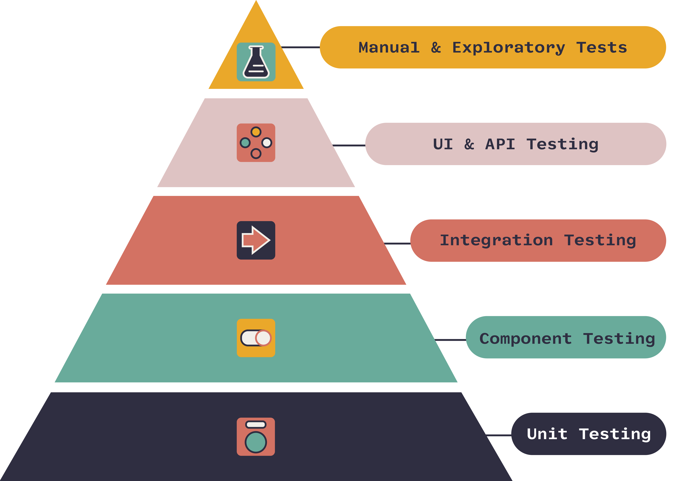

# PokeApiClient

PokeApiClient is a Java client library for interacting with the Pokémon API (PokeAPI). It allows you to fetch data about Pokémon, their abilities, moves, and more.

## Requirements

- Java 17
- Maven 3

## Installation

To use the PokeApiClient, you need to add the following dependencies to your `pom.xml`:

```xml
<dependencies>
    <dependency>
        <groupId>com.fasterxml.jackson.core</groupId>
        <artifactId>jackson-databind</artifactId>
        <version>${jackson.version}</version>
    </dependency>
    <dependency>
        <groupId>com.fasterxml.jackson.core</groupId>
        <artifactId>jackson-core</artifactId>
        <version>${jackson.version}</version>
    </dependency>
    <dependency>
        <groupId>com.fasterxml.jackson.core</groupId>
        <artifactId>jackson-annotations</artifactId>
        <version>${jackson.version}</version>
    </dependency>
    <dependency>
        <groupId>org.junit.jupiter</groupId>
        <artifactId>junit-jupiter-api</artifactId>
        <version>${junit.jupiter.version}</version>
        <scope>test</scope>
    </dependency>
    <dependency>
        <groupId>org.junit.jupiter</groupId>
        <artifactId>junit-jupiter-engine</artifactId>
        <version>${junit.jupiter.version}</version>
        <scope>test</scope>
    </dependency>
    <dependency>
        <groupId>org.mockito</groupId>
        <artifactId>mockito-core</artifactId>
        <version>${mockito.version}</version>
        <scope>test</scope>
    </dependency>
    <dependency>
        <groupId>com.github.tomakehurst</groupId>
        <artifactId>wiremock-jre8</artifactId>
        <version>${wiremock.version}</version>
        <scope>test</scope>
    </dependency>
</dependencies>
```

## Usage

Here's an example of how to use the PokeApiClient to fetch data about a Pokémon:

### Example

```java
import com.truslty.labs.pokeapi.client.PokeApiClient;
import com.truslty.labs.pokeapi.model.Pokemon;

public class PokeApiClientExample {
    public static void main(String[] args) {
        PokeApiClient client = new PokeApiClient("https://pokeapi.co/api/v2");

        try {
            Pokemon ditto = client.getPokemon("ditto");
            System.out.println("ID: " + ditto.id());
            System.out.println("Name: " + ditto.name());
            System.out.println("Base Experience: " + ditto.baseExperience());
            System.out.println("Height: " + ditto.height());
            System.out.println("Weight: " + ditto.weight());
            // Add more fields as needed
        } catch (Exception e) {
            e.printStackTrace();
        }
    }
}
```

### Output

Running the above example will fetch the data for the Pokémon Ditto and print its details.

## Running Tests

This project follows a test pyramid approach. Below is an image representing the different levels of testing:



### Test Levels

1. **Unit Testing**: These tests are the foundation of the pyramid and are used to test individual units of code in isolation. In this project, the unit tests are defined in files ending with `*Test.java`.
    - **Command**: 
      ```sh
      mvn test -Punit-tests
      ```

2. **Component Testing**: These tests are used to test individual components, typically involving external dependencies like databases or APIs. These tests are defined in files ending with `*CT.java`.
    - **Command**: 
      ```sh
      mvn test -Pcomponent-tests
      ```

3. **Integration Testing**: These tests ensure that different components of the application work together as expected. These tests are defined in files ending with `*IT.java`.
    - **Command**: 
      ```sh
      mvn test -Pintegration-tests
      ```

4. **Full Tests**: This profile runs all tests, including unit, component, and integration tests.
    - **Command**: 
      ```sh
      mvn test -Pfull-tests
      ```

### Running Specific Test Profiles

- **Run Unit Tests** (activated by default):
    ```sh
    mvn test
    ```

- **Run Component Tests**:
    ```sh
    mvn test -Pcomponent-tests
    ```

- **Run Integration Tests**:
    ```sh
    mvn test -Pintegration-tests
    ```

- **Run All Tests (Full Tests)**:
    ```sh
    mvn test -Pfull-tests
    ```

## Contributing

Contributions are welcome! Please open an issue or submit a pull request on GitHub.

## License

This project is licensed under the MIT License.
